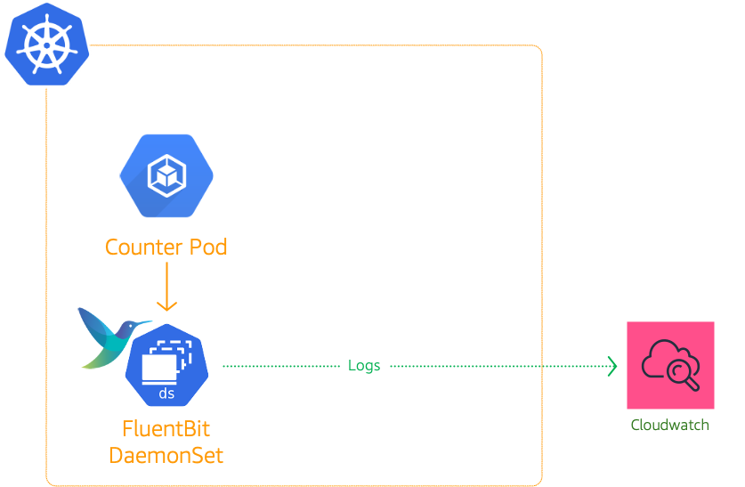
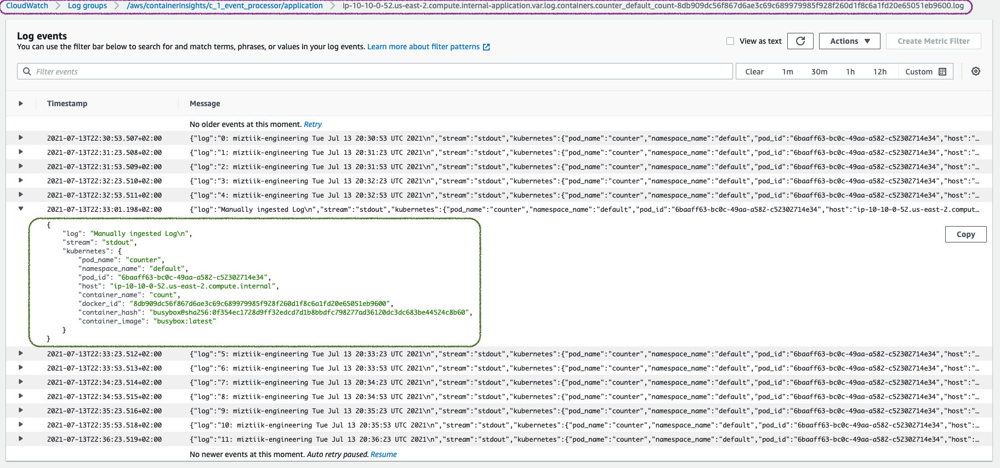

# Kubernetes(EKS) Application Logging using FluentBit

The developer at Mystique Unicorn are interested in building their application using event-driven architectural pattern to process streaming data. For those who are unfamiliar, _An event-driven architecture uses events to trigger and communicate between decoupled services and is common in modern applications built with microservices. An event is a change in state, or an update, like an item being placed in a shopping cart on an e-commerce website._

In this application, Kubernetes has been chosen as the platform to host their application producing and consuming events. Their developers need access to logs for debugging and gain observability of how these producers and consumers applications are performing

Can you help them?

## 🎯 Solutions

Logging is a powerful debugging mechanism for developers and operations teams when they must troubleshoot issues. The best practice for your containerized applications is to write your application logs to the standard output (`stdout`) and standard error (`stderr`) streams.

Log aggregation in Kubernetes is different than logging on traditional servers or virtual machines, mainly due to how Kubernetes manages its applications (pods). In Kubernetes, when pods are evicted, crashed, deleted, or scheduled on a different node, the logs are lost and are not available to troubleshoot issues unless they are stored on persistent storage or routed successfully to another centralized logging destination. The transient nature of default logging in Kubernetes makes it crucial to implement a centralized log management solution. Fluent Bit<sup>[1]</sup> is a lightweight and extensible Log Processor that comes with full support for Kubernetes.

**How does FluentBit work?**

Kubernetes manages a cluster of nodes, so our log agent tool will need to run on every node to collect logs from every POD, hence Fluent Bit is deployed as a DaemonSet. To get started with FluentBit<sup>[1],[2]</sup>, we need to setup few resources on our cluster,

- **Namespace:** `amazon-cloudwatch`
- **Service Account:** `fluent-bit`
- **IAM Role:** Permissions to create logs groups and streams. The service account `fluent-bit` will be annotated with this Role enabling it to push logs to cloudwatch.
- **ClusterRole** & **ClusterRoleBining** Allows the daemon set to access the container logs.
- **ConfigMap:** `fluent-bit-cluster-info` - We will use the configmap to let fluentbit know about the AWS Region, cluster name and any other custom information that we want to pass onto FluentBit.

In this blog, I will show you how to setup logging in EKS using FluentBit.



1. ## 🧰 Prerequisites

   This demo, instructions, scripts and cloudformation template is designed to be run in `us-east-1`. With few modifications you can try it out in other regions as well(_Not covered here_).

   - 🛠 AWS CLI Installed & Configured - [Get help here](https://youtu.be/TPyyfmQte0U)
   - 🛠 AWS CDK Installed & Configured - [Get help here](https://www.youtube.com/watch?v=MKwxpszw0Rc)
   - 🛠 Python Packages, _Change the below commands to suit your OS, the following is written for amzn linux 2_
     - Python3 - `yum install -y python3`
     - Python Pip - `yum install -y python-pip`
     - Virtualenv - `pip3 install virtualenv`

1. ## ⚙️ Setting up the environment

   - Get the application code

     ```bash
     git clone https://github.com/miztiik/eks-log-shipping-with-fluentbit
     cd eks-log-shipping-with-fluentbit
     ```

1. ## 🚀 Prepare the dev environment to run AWS CDK

   We will use `cdk` to make our deployments easier. Lets go ahead and install the necessary components.

   ```bash
   # You should have npm pre-installed
   # If you DONT have cdk installed
   npm install -g aws-cdk

   # Make sure you in root directory
   python3 -m venv .venv
   source .venv/bin/activate
   pip3 install -r requirements.txt
   ```

   The very first time you deploy an AWS CDK app into an environment _(account/region)_, you’ll need to install a `bootstrap stack`, Otherwise just go ahead and deploy using `cdk deploy`.

   ```bash
   cdk bootstrap
   cdk ls
   # Follow on screen prompts
   ```

   You should see an output of the available stacks,

   ```bash
   eks-cluster-vpc-stack-01
   eks-cluster-stack-01
   ssm-agent-installer-daemonset-stack-01
   eks-log-shipping-stack-01
   ```

1. ## 🚀 Deploying the application

   Let us walk through each of the stacks,

   - **Stack: eks-cluster-vpc-stack-01**
     To host our EKS cluster we need a custom VPC. This stack will build a multi-az VPC with the following attributes,

     - **VPC**:
       - 2-AZ Subnets with Public, Private and Isolated Subnets.
       - 1 NAT GW for internet access from private subnets

     Initiate the deployment with the following command,

     ```bash
     cdk deploy eks-cluster-vpc-stack-01
     ```

     After successfully deploying the stack, Check the `Outputs` section of the stack for the

   - **Stack: eks-cluster-stack-01**
     As we are starting out a new cluster, we will use most default. No logging is configured or any add-ons. The cluster will have the following attributes,

     - The control pane is launched with public access. _i.e_ the cluster can be access without a bastion host
     - `c_admin` IAM role added to _aws-auth_ configMap to administer the cluster from CLI.
     - One **OnDemand** managed EC2 node group created from a launch template
       - It create two `t3.medium` instances running `Amazon Linux 2`.
       - Auto-scaling Group with `2` desired instances.
       - The nodes will have a node role attached to them with `AmazonSSMManagedInstanceCore` permissions
       - Kubernetes label `app:miztiik_on_demand_ng`

     The EKS cluster will be created in the custom VPC created earlier. Initiate the deployment with the following command,

     ```bash
     cdk deploy eks-cluster-stack-01
     ```

     After successfully deploying the stack, Check the `Outputs` section of the stack. You will find the `**ConfigCommand**` that allows yous to interact with your cluster using `kubectl`

   - **Stack: ssm-agent-installer-daemonset-stack-01**
     This EKS AMI used in this stack does not include the AWS SSM Agent out of the box. If we ever want to patch or run something remotely on our EKS nodes, this agent is really helpful to automate those tasks. We will deploy a daemonset that will _run exactly once?_ on each node using a cron entry injection that deletes itself after successful execution. If you are interested take a look at the daemonset manifest here `stacks/back_end/eks_cluster_stacks/eks_ssm_daemonset_stack/eks_ssm_daemonset_stack.py`. This is inspired by this AWS guidance.

     Initiate the deployment with the following command,

     ```bash
     cdk deploy ssm-agent-installer-daemonset-stack-01
     ```

     After successfully deploying the stack, You can connect to the worker nodes instance using SSM Session Manager.

   - **Stack: eks-log-shipping-stack-01**

     This stack will create the following resources,

     - **IAM Role:** For FluentBit to push logs - The permissions are as given below

       ```json
       {
         "Version": "2012-10-17",
         "Statement": [
           {
             "Effect": "Allow",
             "Action": [
               "logs:CreateLogStream",
               "logs:CreateLogGroup",
               "logs:DescribeLogStreams",
               "logs:PutLogEvents"
             ],
             "Resource": "*"
           }
         ]
       }
       ```

     - **Service Account:** `fluent-bit`. This service account will be annotated with the IAM Role arn created in the previous step. An example annotation looks like this, `arn:aws:iam::111122223333:role/eks-log-shipping-stack-01-fluentbitlogshippersvcac`
     - **Namespace:** `amazon-cloudwatch`
     - **ConfigMap:** `fluent-bit-cluster-info` - We will use the configmap to let fluentbit know about the AWS Region, cluster name and any other custom information that we want to pass onto FluentBit.

     Initiate the deployment with the following command,

     ```bash
     cdk deploy eks-log-shipping-stack-01
     ```

     After successfully deploying the stack, You can find the IAM role arn `ExternalDnsProviderRole`.

1. ## 🔬 Testing the solution

   1. **Deploy FluentBit DaemonSet**

      We have already created the namespace, service account and ConfigMap for FluentBit Daemonset to use. Let us go ahead and deploy the manifest that will deploy the Daemonset. A sample of the manifest is provided under here `stacks/k8s_utils/manifests/eks_fluentbit_config.yml`.

      Deploy the manifest,

      ```bash
      kubectl apply -f eks_fluentbit_config.yml
      ```

      Confirm the fluentbit pod have been deployed:

      ```bash
      kubectl get pods -n amazon-cloudwatch
      ```

      Expected output,

      ```bash
      NAME               READY   STATUS    RESTARTS   AGE
      fluent-bit-9v82p   1/1     Running   1          28h
      fluent-bit-mb5kq   1/1     Running   1          28h
      ```

   1. **Deploy Pod to generate logs**

      A sample of the very simple `counter` pod that periodically logs to the console is shown below.

      ```text
      apiVersion: v1
      kind: Pod
      metadata:
      name: counter
      namespace: default
      labels:
         name: counter
         owner: miztiik_automation
         compute_provider: ec2
         dept: engineering
         team: red-shirts
      spec:
      containers:
      - name: count
         image: busybox
         args: [/bin/sh, -c,'i=0; while true; do echo "$i: miztiik-engineering $(date)"; i=$((i+1)); sleep 30; done']
      ```

      ```bash
      kubectl apply -f fluentd_counter.yml
      ```

      Confirm the _counter_ pod is running,

      ```bash
      manifests]# kubectl get po -l name=counter
      NAME      READY   STATUS    RESTARTS   AGE
      counter   1/1     Running   1          29h
      ```

      In addition to automatically generated logs, let us manually ingest couple of lines to the logs and then check in cloudwatch logs. We need to ingest logs to process pid of `1` as that is what is monitored by kubernetes.

      ```bash
      manifests]# kubectl exec -ti counter -- sh
      / # echo "Manually ingested Log" >> /proc/1/fd/1
      / #
      ```

      Confirm the pod is logging,

      ```bash
      kubectl logs counter
      ```

      You should see something like this,

      ```bash
      manifests]# kubectl logs counter
      0: miztiik-engineering Tue Jul 13 20:30:53 UTC 2021
      1: miztiik-engineering Tue Jul 13 20:31:23 UTC 2021
      2: miztiik-engineering Tue Jul 13 20:31:53 UTC 2021
      3: miztiik-engineering Tue Jul 13 20:32:23 UTC 2021
      4: miztiik-engineering Tue Jul 13 20:32:53 UTC 2021
      Manually ingested Log
      5: miztiik-engineering Tue Jul 13 20:33:23 UTC 2021
      6: miztiik-engineering Tue Jul 13 20:33:53 UTC 2021
      7: miztiik-engineering Tue Jul 13 20:34:23 UTC 2021
      ```

      Now lets go to cloudwatch console and check if these logs are showing up there,
      

1. ## 📒 Conclusion

   Here we have demonstrated how to use Fluent Bit for logging containers in kubernetes. You can use this feature for Fargate as well or create dashboards with Grafana or Kibana.

1. ## 🧹 CleanUp

   If you want to destroy all the resources created by the stack, Execute the below command to delete the stack, or _you can delete the stack from console as well_

   - Resources created during [Deploying The Application](#-deploying-the-application)
   - Delete CloudWatch Lambda LogGroups
   - _Any other custom resources, you have created for this demo_

   ```bash
   # Delete from cdk
   cdk destroy

   # Follow any on-screen prompts

   # Delete the CF Stack, If you used cloudformation to deploy the stack.
   aws cloudformation delete-stack \
     --stack-name "MiztiikAutomationStack" \
     --region "${AWS_REGION}"
   ```

   This is not an exhaustive list, please carry out other necessary steps as maybe applicable to your needs.

## 📌 Who is using this

This repository aims to show how to do container logging to new developers, Solution Architects & Ops Engineers in AWS. Based on that knowledge these Udemy [course #1][102], [course #2][101] helps you build complete architecture in AWS.

### 💡 Help/Suggestions or 🐛 Bugs

Thank you for your interest in contributing to our project. Whether it is a bug report, new feature, correction, or additional documentation or solutions, we greatly value feedback and contributions from our community. [Start here](/issues)

### 👋 Buy me a coffee

[](https://ko-fi.com/Q5Q41QDGK) Buy me a [coffee ☕][900].

### 📚 References

1. [FluentBit Docs: FluentBit for Kubernetes][1]
1. [AWS Docs: FluentBit as DaemonSet][2]

### 🏷️ Metadata


**Level**: 200

[1]: https://docs.fluentbit.io/manual/installation/kubernetes
[2]: https://docs.aws.amazon.com/en_en/AmazonCloudWatch/latest/monitoring/Container-Insights-setup-logs-FluentBit.html
[100]: https://www.udemy.com/course/aws-cloud-security/?referralCode=B7F1B6C78B45ADAF77A9
[101]: https://www.udemy.com/course/aws-cloud-security-proactive-way/?referralCode=71DC542AD4481309A441
[102]: https://www.udemy.com/course/aws-cloud-development-kit-from-beginner-to-professional/?referralCode=E15D7FB64E417C547579
[103]: https://www.udemy.com/course/aws-cloudformation-basics?referralCode=93AD3B1530BC871093D6
[899]: https://www.udemy.com/user/n-kumar/
[900]: https://ko-fi.com/miztiik
[901]: https://ko-fi.com/Q5Q41QDGK
